<p align="center">
  <picture>
    <source media="(prefers-color-scheme: dark)" srcset="docs/assets/chippytea-dark.svg">
    <source media="(prefers-color-scheme: light)" srcset="docs/assets/chippytea-light.svg">
    
  </picture>
</p>

<h3 align="center">Free up space on your Mac.</h3>

<p align="center">
  chippytea is an ultra-performant, native macOS app that clears space on your Mac.
  Built with SwiftUI and Rust, it helps you find app caches, developer tools, old build folders
  and downloads you may no longer need. Review their estimated sizes, see what removing
  them means, and choose what to keep or remove.<br>
  SwiftUI + Rust · macOS 14+ · Free and open source
</p>

<p align="center">
  <a href="#build-and-run">Build it</a> ·
  <a href="#how-it-works">How it works</a> ·
  <a href="CONTRIBUTING.md">Contribute</a> ·
  <a href="SECURITY.md">Security</a>
</p>

<picture>
  <source media="(prefers-color-scheme: dark)" srcset="docs/assets/readme-dark.svg">
  <source media="(prefers-color-scheme: light)" srcset="docs/assets/readme-light.svg">
  
</picture>

<p align="center"><sub>An illustrated cleanup, not a live scan. Animation respects reduced motion.</sub></p>

chippytea runs locally from your menu bar. No account, no telemetry, no automatic deletion.

## How it works

1. **Find cleanup opportunities.** Scan folders you choose, or use **Scan my Mac** for app and developer caches, logs, Xcode data, Python bytecode, build folders, downloads and large personal files. It also checks known system and tool-managed storage locations automatically.
2. **Check before you clean.** Review the files, estimated size, and consequences. Git and activity checks vary by category; personal files and caches without an identified owning app still need your judgment.
3. **Choose what to remove.** Move files to Trash, or permanently remove eligible developer caches, build files and dependencies. Review the outcome and any credited space in the cleanup history.

**Check duplicate files** compares already-indexed old/large personal-file suggestions when you ask. It verifies contents, lets you choose one copy to keep and one to review, and rechecks both before moving the selected copy to Trash. This is a bounded check, not a whole-Mac duplicate search; ordinary scans never hash personal-file contents.

Moving files to **Trash does not free storage**. App caches, logs, Python bytecode, Xcode DerivedData, downloads and personal files are review/Trash-only; they never earn chips. Verified developer caches, build files and dependencies can be deleted permanently after their ownership, activity and contents are rechecked.

Known npm, npx, Corepack, Bun, pip, uv, mise, Cargo, SwiftPM, Zig, Expo, Homebrew download and AWS CLI caches appear in the same cleanup list, with the same checkboxes and review action. Only recognized cache directories are eligible; active tools, shared files and unrelated configuration stay protected. Blocked caches stay in the list with their reason and cleanup disabled. Installed toolchains, container data and system locations appear alongside cleanup findings with their relevant review steps. Their measured size does not establish how much is removable; some system locations need administrator access.

Use **Settings → Scan locations & access** to add a folder or mounted drive, reconnect an unavailable location, or redo access setup. Saved volume identities handle macOS device-number changes without renewing a valid folder grant. Older grants that are already invalid need one explicit reconnection; Keep choices and cleanup history are preserved.

This is early software that can permanently delete files. Start with a disposable test folder and keep backups. Full Disk Access is optional.

<details>
<summary>About the chip counter</summary>

The chips are a decorative counter for space saved. Eligible permanent cleanup adds one chip per **100 MB of conservatively credited space**. Smaller amounts carry forward.

Chips stay on your Mac and have no monetary value. Moving files to Trash adds no chips; estimated sizes never update the counter.

</details>

## Build and run

You'll need an **Apple Silicon Mac**, **macOS 14 or later**, **Xcode with its command-line tools**, **Python 3**, and a [Rust toolchain](https://rustup.rs/).

```sh
git clone https://github.com/richiemcilroy/chippytea.git
cd chippytea
./scripts/build.sh
open build/chippytea.app
```

Local builds are ad-hoc signed by default, not notarized releases. Quit the running app before rebuilding.

```sh
env -u CARGO_TARGET_DIR -u CARGO_BUILD_TARGET_DIR cargo test --locked
cargo clippy --all-targets --locked -- -D warnings
```

Working on the landing page? See [site/README.md](site/README.md).

## Project structure

| Part | What's inside |
| --- | --- |
| [Rust engine](core/src) | Bounded discovery, SQLite index, safety checks, cleanup, and a durable reward ledger |
| [Native app](native/Chippytea) | SwiftUI interface, menu-bar panel, Finder and Trash integration, hand-drawn fish and chips |
| [Landing page](site) | The same drawing paths and chip-shop style, built with Next.js |
| [Tests and benchmarks](scripts) | Disposable fixtures, native integration checks, and reproducible performance tools |

## Contributing

Bug reports, careful safety tests, clearer docs, and small fixes are welcome. Read [CONTRIBUTING.md](CONTRIBUTING.md) before changing cleanup behaviour. Please keep personal paths, logs, and credentials out of public issues. Security problems belong in a [private report](https://github.com/richiemcilroy/chippytea/security/advisories/new).

[MIT licensed](LICENSE).
